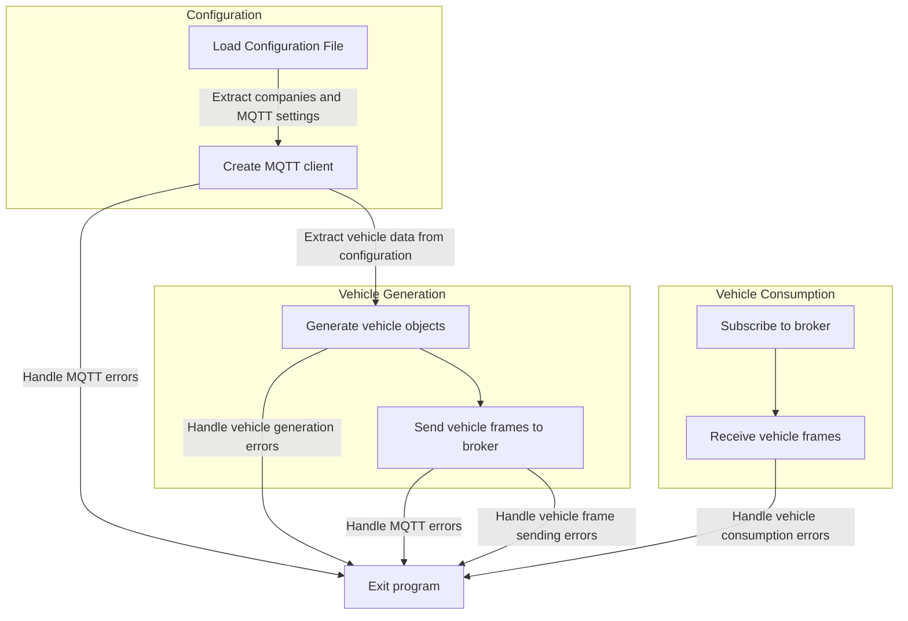

# Program Behavior
This program simulates a fleet of vehicles sending data to an MQTT broker. The program generates vehicle objects with randomly generated data and sends the data frames to the broker.

High-Level Overview
The program can be divided into two main parts: the simulation generator and the MQTT broker connection.

The simulation generator is responsible for generating the vehicles and sending their data frames to the broker. The program generates a list of available vehicles and loops through them until there are no more vehicles left. The generator selects a random vehicle from the available list, generates its data frame, and sends it to the MQTT broker. The generator then removes the selected vehicle from the available list and continues looping until there are no more vehicles left.

The MQTT broker connection is responsible for receiving the data frames from the vehicles and handling any errors that may occur.

# Code Explanation
The main function of the program is generateSimulation. This function generates the vehicle objects and sends their data frames to the MQTT broker.

The program starts by importing the necessary modules and the configuration object. The generateSimulation function then creates an empty list of available vehicles. It loops through each company in the configuration object and generates a list of vehicles for that company. It then concatenates the company's list of vehicles to the list of available vehicles.

Once the available vehicle list is generated, the program loops through the list and selects a random vehicle. It generates the data frame for that vehicle and sends it to the MQTT broker. The program then removes the selected vehicle from the available list and continues looping until there are no more vehicles left.

The program uses the MQTT module to connect to the broker and subscribe to a topic. The program then listens for messages from the broker and logs them to the console.

# Flowchart
Here's a flowchart to better illustrate the behavior of the program:

Overall, the program generates and sends data frames for each vehicle in the available vehicle list until there are no more vehicles left. The program then ends.
